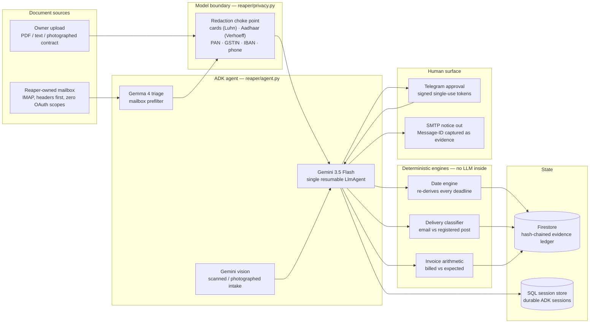
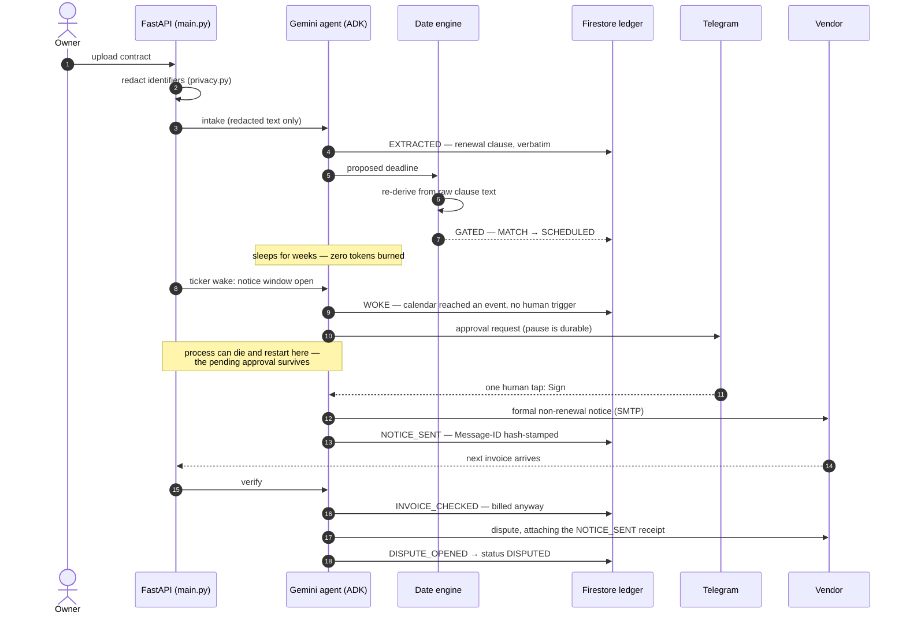
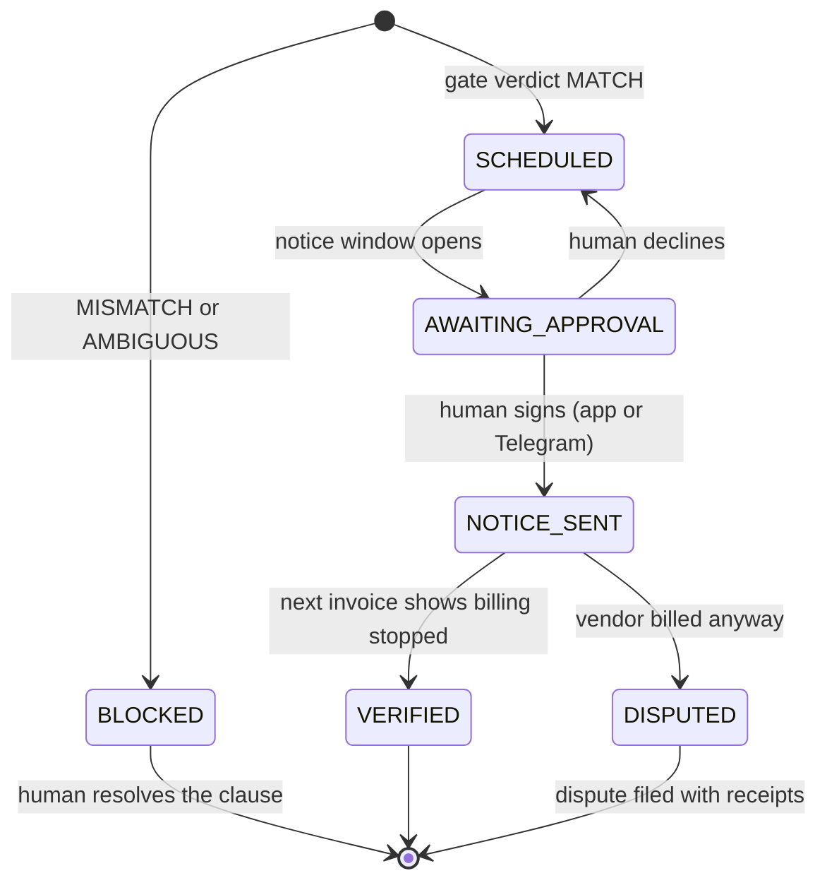
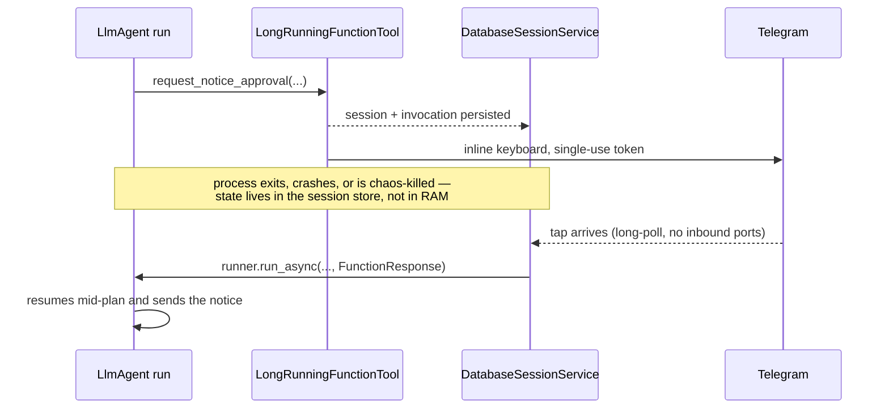
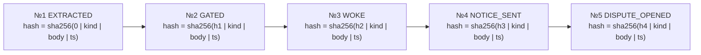
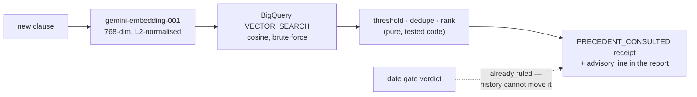
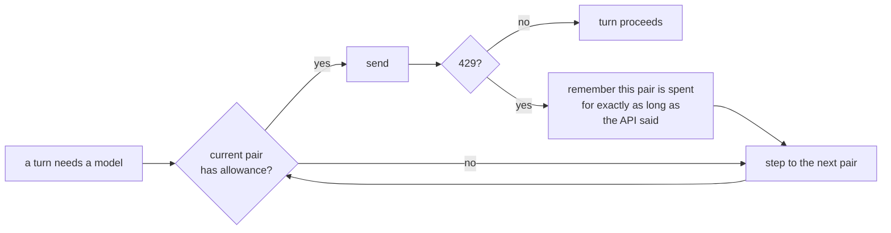
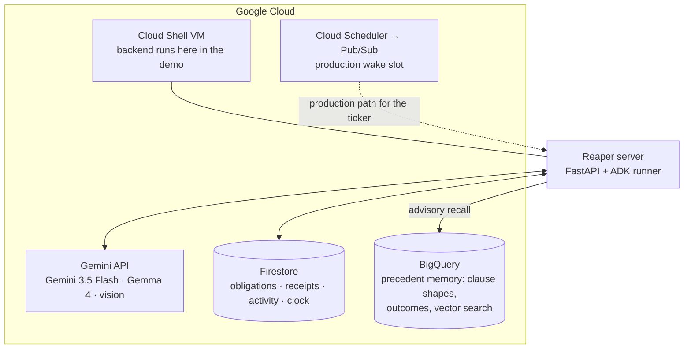

# Reaper — Architecture

Reaper is built around one design rule: **the model proposes, deterministic
engines dispose.** Gemini reads contracts, drafts notices, and decides *when*
to act — but no date it extracts is ever trusted without independent
re-derivation, no notice leaves without a human signature, and every step is
hash-chained into an append-only evidence ledger. If the agent is ever wrong,
the ledger is how you find out; if a vendor disputes, the ledger is how you win.

## System map

Every arrow into the agent passes through the redaction choke point
(`main.py::_intake`); every arrow out of the engines lands in the ledger as a
receipt. The model never sees raw identifiers and never writes ledger state
directly — tools do, after their own checks pass.

## The autonomous arc

The full villain path — the one in the demo film — from intake to a dispute
the vendor cannot argue with:

Steps 5–6 are the security boundary in action: the model's reading of the
deadline is checked against a regex-and-calendar re-derivation of the same
clause. Words-vs-numerals traps ("sixty (90) days") come back `AMBIGUOUS` and
the obligation is **BLOCKED** — no notice is ever queued on an unverified date.

## Obligation lifecycle

`BLOCKED` is a feature, not a failure: it is the state where the system
refused to gamble on its own reading.

## The durable pause

The one human decision is a real pause, not a poll. It survives process death.

Implementation notes that took real debugging to earn:

- `App(resumability_config=ResumabilityConfig(is_resumable=True))` with a
  **single root agent** — sub-agent and sequential-agent LRO paths have known
  upstream issues in ADK.
- `DatabaseSessionService` over an async SQL driver holds the paused
  invocation; the resume pointer lives in the ledger and is cleared **only
  after a successful resume**, so a crashed resume never loses the decision.
- Approval tokens are single-use and bound to the enrolled chat id; a tap from
  an unenrolled device is logged to the ledger as `APPROVAL_DENIED`.

## The evidence chain

Every receipt is hash-linked to the previous one, per obligation:

Editing any historical receipt breaks every hash after it, and
`GET /obligations/{id}/receipts` re-verifies the chain on every read.

**Chain 0 is the mailbox access log.** Every header scan, every message the
agent declined to open, and every open-with-reason is a chained receipt. This
makes honesty structural: falsifying the access log would break the same chain
the dispute evidence depends on — cheating is self-destructive.

Receipt kinds in the ledger today: `READ_AS`, `REDACTED`, `EXTRACTED`,
`PRECEDENT_CONSULTED`, `GATED`, `WOKE`, `APPROVAL_REQUESTED`,
`APPROVAL_OFFERED`, `NOTICE_SENT`, `INVOICE_CHECKED`, `DISPUTE_OPENED`,
`DISPUTE_BACKSTOP`, `VENDOR_REPLY` — plus the chain-0 mailbox events. A vendor reply threaded onto our own Message-ID is recorded as
`VENDOR_REPLY`: third-party corroboration captured automatically.

## Precedent memory

Reaper's second Google Cloud surface is institutional memory. Every clause it
has gated — plus a committed corpus of labelled clause shapes — lives in a
**BigQuery** table with a 768-dim `gemini-embedding-001` vector per row.
During intake, after the date gate has already ruled, the new clause is
embedded and matched by brute-force `VECTOR_SEARCH`:

Three rules keep it honest:

- **Advisory only.** The lookup fires *after* the gate; a test asserts that a
  97%-similar BLOCKED precedent cannot flip a clean clause off `MATCH`.
- **Misses are receipted too.** If the store is off, empty, or unreachable,
  the chain records `available: false` with the reason — "unavailable" and
  "no precedent exists" are different facts.
- **Corpus rows say they are corpus.** Seeded shapes carry `source: "fixture"`
  and describe themselves as such; live outcomes carry `source: "ledger"` and
  the terminal receipt hash they trace back to.

The store runs in the BigQuery sandbox (no billing account): writes are load
jobs (the sandbox forbids DML and streaming), and sandbox tables expire after
60 days — the seeding script re-arms the expiry on every run.

## Trust boundaries

| The model may | The model may not |
|---|---|
| Read redacted contract text and quote the clause | See card numbers, Aadhaar, PAN, GSTIN, IBAN, phone numbers |
| Propose a notice deadline | Schedule one — only the date engine's `MATCH` can |
| Draft the non-renewal notice | Send it — only a signed human approval releases it |
| Read invoice documents | Rule on them — the billed-vs-expected check is arithmetic |
| Ask to open a mailbox message | Open it silently — every open is a chain-0 receipt with a reason |
| See how similar clauses resolved before | Let that history change a verdict — precedent is recalled *after* the gate rules, and is labelled prior history |

## Running unattended

An agent that sleeps for months and wakes at 3am has to survive the ordinary
indignities of infrastructure without inventing an answer. Three of them shaped
this design, and each is enforced in code rather than hoped for.

### Quota is a matrix, not a number

Free-tier Gemini grants `GenerateRequestsPerDayPerProjectPerModel-FreeTier`:
a small daily allowance **per project and per model**. So capacity is a grid of
(API key, model) pairs, each its own bucket, and the way to survive a spent
bucket is to move to a different one.

- `GET /quota` reports what remains, counting buckets and never printing a key.
- `scripts/quota_census.py` asks every pair directly, so capacity is measured
  rather than assumed.
- A refusal carries the second it will be served again; that is honoured
  instead of guessed at. Sitting out an hour on a request that recovers in a
  minute is quota thrown away, not saved.
- The transport retries genuine server errors and **never** a quota refusal:
  a daily allowance does not return inside a retry window, so retrying it just
  spends more of a bucket that has none.

### A turn is capped

The agent framework's default ceiling is five hundred model calls per turn.
This agent needs a handful, and an uncapped turn is not a safety net but a
cannon: one confused turn can spend a day's allowance in seconds. `RunConfig`
caps it at `REAPER_MAX_LLM_CALLS` (default 12).

That cap's own error mentions the number 500, which a substring match once read
as a server error — so a capped turn was retried *and* the healthy bucket it ran
on was blamed and locked out. Errors are now classified by what they are: only a
real 429 marks a bucket spent.

### Nothing blocks the event loop

The platform decides an instance is dead when a health check goes unanswered for
five seconds. A synchronous Firestore round trip or a blocking triage call on the
event loop will do exactly that — and when the instance is restarted, the agent
run in flight dies leaving no exception, no log, and a status that simply never
moves.

So: **an endpoint that touches Firestore or a model is a plain `def`** (which
FastAPI runs in a worker thread), or it offloads explicitly with
`asyncio.to_thread`. The ticker, intake, upload and wake paths all follow this.

### Failure is recorded, never inferred

| What happens | What the record says |
|---|---|
| A model refuses on quota | `RUN_ATTEMPT_FAILED` with the attempt and the error |
| A model returns an empty turn | `RUN_EMPTY` with the model and key that produced it |
| A wake leaves the obligation where it was | `WAKE_DEGRADED` — the ledger is the truth, not the run's self-report |
| A crash strands a paused approval | `APPROVAL_RESET`, and the notice window re-opens |
| The same contract is filed twice | `DUPLICATE_FILING_IGNORED` on the original |

None of these guess. A run that reports success while the ledger did not move is
treated as the failure it is, and the next attempt uses a different model rather
than asking the silent one again.

## Google Cloud deployment

Today the wake path is a self-owned asyncio ticker inside the server (every
wake is a `WOKE` receipt — the agent acts unprompted, on calendar time). The
ticker's production slot is Cloud Scheduler firing through Pub/Sub; the
Dockerfile in the repo root builds the container for that deployment.

## Module index

| Module | Responsibility |
|---|---|
| `main.py` | FastAPI surface, intake choke point, ticker, approval delivery, chaos kill |
| `reaper/agent.py` | The single resumable `LlmAgent`, phase instructions, model rotation hook |
| `reaper/tools.py` | Agent tools: gate-and-schedule, send notice, check invoice, open dispute |
| `reaper/date_engine.py` | Deterministic deadline re-derivation and the MATCH/MISMATCH/AMBIGUOUS gate |
| `reaper/delivery.py` | Notice delivery-method ruling (email-compliant vs courtesy copy) |
| `reaper/privacy.py` | Checksum-validated identifier redaction at the model boundary |
| `reaper/ledger.py` | Backend facade — `ledger_firestore.py` (Google Cloud) / `ledger_sqlite.py` (tests) |
| `reaper/mailbox.py` | Owned-mailbox IMAP pipeline: headers → admission → hash → prefilter → intake |
| `reaper/approvals.py` | Telegram long-poll approvals, token verification, denial logging |
| `reaper/llm.py` | Quota-resilient Gemini access: retries, key rotation, model ladder |
| `reaper/precedent.py` | BigQuery precedent memory: embeddings, vector recall, fail-open advisory |
| `reaper/vision.py` / `reaper/triage.py` | Scanned-document reading · Gemma mailbox triage |
| `reaper/clock.py` | The living calendar (persistent simulated time for the demo) |
