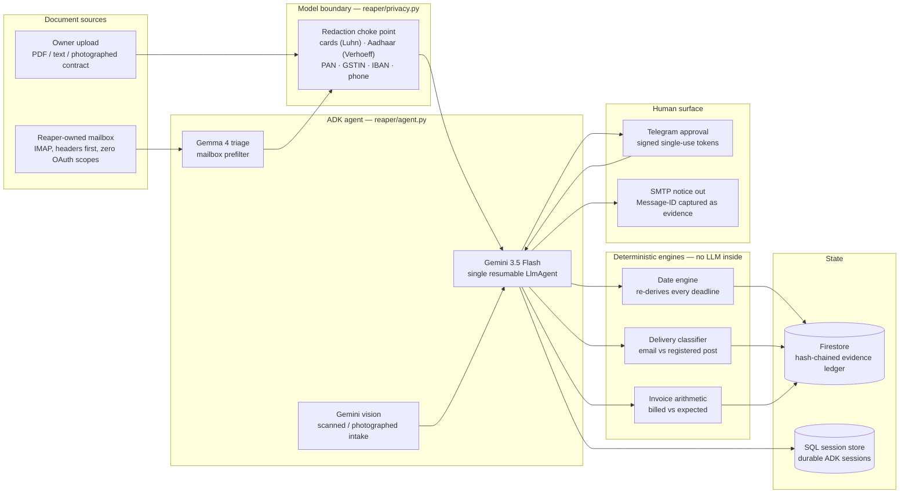
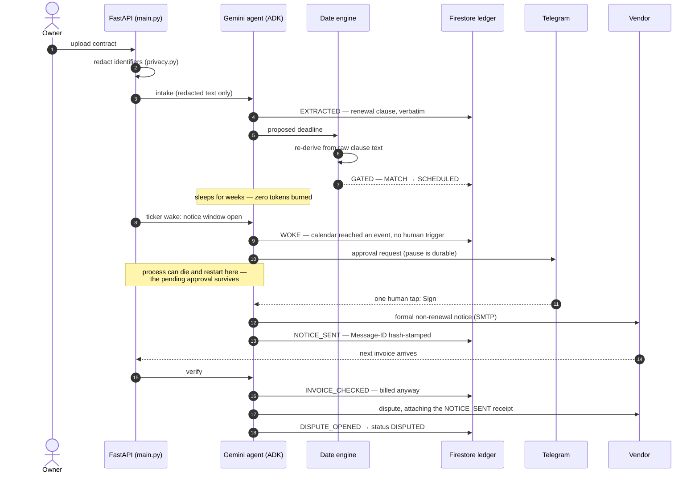
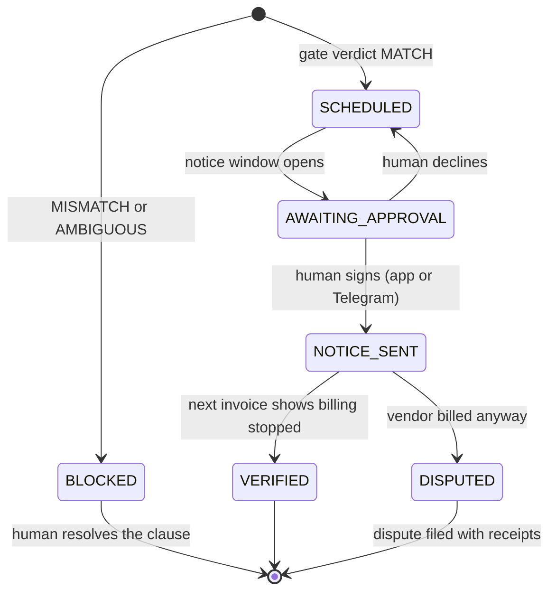
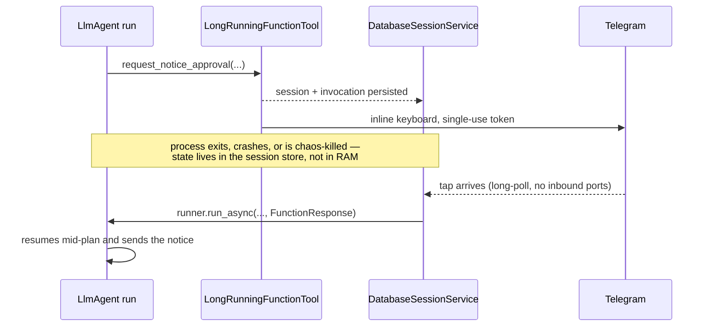
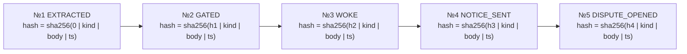
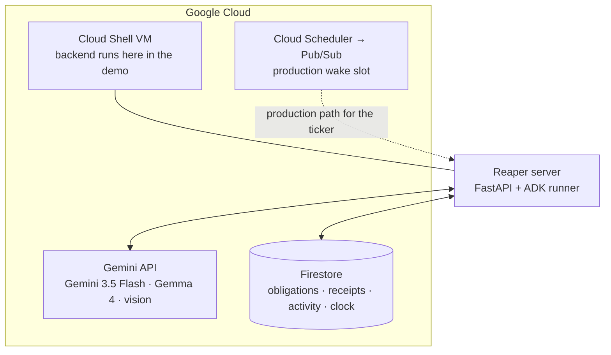

# Reaper — Architecture

Reaper is built around one design rule: **the model proposes, deterministic
engines dispose.** Gemini reads contracts, drafts notices, and decides *when*
to act — but no date it extracts is ever trusted without independent
re-derivation, no notice leaves without a human signature, and every step is
hash-chained into an append-only evidence ledger. If the agent is ever wrong,
the ledger is how you find out; if a vendor disputes, the ledger is how you win.

## System map

Every arrow into the agent passes through the redaction choke point
(`main.py::_intake`); every arrow out of the engines lands in the ledger as a
receipt. The model never sees raw identifiers and never writes ledger state
directly — tools do, after their own checks pass.

## The autonomous arc

The full villain path — the one in the demo film — from intake to a dispute
the vendor cannot argue with:

Steps 5–6 are the security boundary in action: the model's reading of the
deadline is checked against a regex-and-calendar re-derivation of the same
clause. Words-vs-numerals traps ("sixty (90) days") come back `AMBIGUOUS` and
the obligation is **BLOCKED** — no notice is ever queued on an unverified date.

## Obligation lifecycle

`BLOCKED` is a feature, not a failure: it is the state where the system
refused to gamble on its own reading.

## The durable pause

The one human decision is a real pause, not a poll. It survives process death.

Implementation notes that took real debugging to earn:

- `App(resumability_config=ResumabilityConfig(is_resumable=True))` with a
  **single root agent** — sub-agent and sequential-agent LRO paths have known
  upstream issues in ADK.
- `DatabaseSessionService` over an async SQL driver holds the paused
  invocation; the resume pointer lives in the ledger and is cleared **only
  after a successful resume**, so a crashed resume never loses the decision.
- Approval tokens are single-use and bound to the enrolled chat id; a tap from
  an unenrolled device is logged to the ledger as `APPROVAL_DENIED`.

## The evidence chain

Every receipt is hash-linked to the previous one, per obligation:

Editing any historical receipt breaks every hash after it, and
`GET /obligations/{id}/receipts` re-verifies the chain on every read.

**Chain 0 is the mailbox access log.** Every header scan, every message the
agent declined to open, and every open-with-reason is a chained receipt. This
makes honesty structural: falsifying the access log would break the same chain
the dispute evidence depends on — cheating is self-destructive.

Receipt kinds in the ledger today: `READ_AS`, `REDACTED`, `EXTRACTED`,
`GATED`, `WOKE`, `APPROVAL_REQUESTED`, `APPROVAL_OFFERED`, `NOTICE_SENT`,
`INVOICE_CHECKED`, `DISPUTE_OPENED`, `VENDOR_REPLY` — plus the chain-0 mailbox
events. A vendor reply threaded onto our own Message-ID is recorded as
`VENDOR_REPLY`: third-party corroboration captured automatically.

## Trust boundaries

| The model may | The model may not |
|---|---|
| Read redacted contract text and quote the clause | See card numbers, Aadhaar, PAN, GSTIN, IBAN, phone numbers |
| Propose a notice deadline | Schedule one — only the date engine's `MATCH` can |
| Draft the non-renewal notice | Send it — only a signed human approval releases it |
| Read invoice documents | Rule on them — the billed-vs-expected check is arithmetic |
| Ask to open a mailbox message | Open it silently — every open is a chain-0 receipt with a reason |

## Google Cloud deployment

Today the wake path is a self-owned asyncio ticker inside the server (every
wake is a `WOKE` receipt — the agent acts unprompted, on calendar time). The
ticker's production slot is Cloud Scheduler firing through Pub/Sub; the
Dockerfile in the repo root builds the container for that deployment.

## Module index

| Module | Responsibility |
|---|---|
| `main.py` | FastAPI surface, intake choke point, ticker, approval delivery, chaos kill |
| `reaper/agent.py` | The single resumable `LlmAgent`, phase instructions, model rotation hook |
| `reaper/tools.py` | Agent tools: gate-and-schedule, send notice, check invoice, open dispute |
| `reaper/date_engine.py` | Deterministic deadline re-derivation and the MATCH/MISMATCH/AMBIGUOUS gate |
| `reaper/delivery.py` | Notice delivery-method ruling (email-compliant vs courtesy copy) |
| `reaper/privacy.py` | Checksum-validated identifier redaction at the model boundary |
| `reaper/ledger.py` | Backend facade — `ledger_firestore.py` (Google Cloud) / `ledger_sqlite.py` (tests) |
| `reaper/mailbox.py` | Owned-mailbox IMAP pipeline: headers → admission → hash → prefilter → intake |
| `reaper/approvals.py` | Telegram long-poll approvals, token verification, denial logging |
| `reaper/llm.py` | Quota-resilient Gemini access: retries, key rotation, model ladder |
| `reaper/vision.py` / `reaper/triage.py` | Scanned-document reading · Gemma mailbox triage |
| `reaper/clock.py` | The living calendar (persistent simulated time for the demo) |
