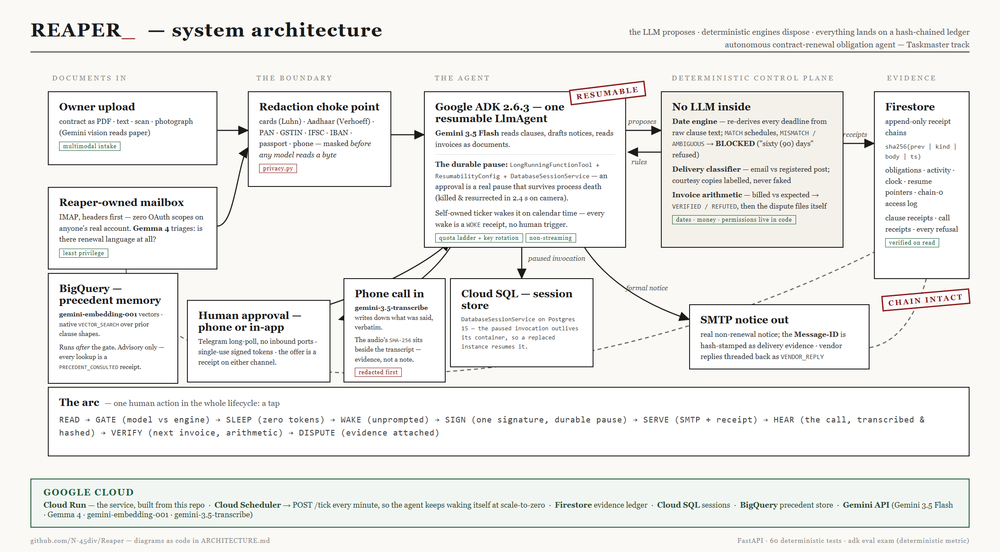

# Reaper

**The agent that finishes the cancellation chore — and checks that the vendor
obeyed.**

[**Live demo**](https://reaper-t2w3ltp6fa-uc.a.run.app) ·
[**Architecture**](ARCHITECTURE.md) ·
[**Testing guide**](TESTING.md)

Every renewal tool on the market stops at reminding a human. Reaper sleeps for
months as a durable timer, wakes inside the contractual notice window, sends
the actual non-renewal notice after one human approval, hash-stamps the
delivery receipt — then reads the *next invoice* to verify the vendor really
stopped billing. If they billed anyway, it opens the dispute itself, attaching
its own timestamped receipt as evidence.

| | the step | what actually happens |
|---|---|---|
| **contract in** | `READ & GATE` | Gemini quotes the renewal clause verbatim; a deterministic date engine re-derives the deadline from the same text. `MATCH` schedules it — any disagreement is `BLOCKED` and a human is asked |
| | `SLEEP` | months pass, zero tokens burned |
| | `WAKE` | the calendar reaches the notice window. No human trigger, and the wake is itself a receipt |
| | `SIGN` | one human approval, in the app or on a phone. The pause is durable and survives the process being killed |
| | `SERVE` | a real SMTP notice; the Message-ID is hash-chained as delivery evidence |
| **next invoice** | `VERIFY` | billed vs expected is arithmetic, not opinion. `VERIFIED` → done · `REFUTED` → the dispute files itself, delivery receipt attached |

## Three rules it never breaks

**1. The model proposes, deterministic engines dispose.** Gemini reads the
clause and suggests a deadline; plain regex-and-calendar code re-derives it
from the same text. Any disagreement blocks scheduling — including the demo's
booby-trapped clause that reads *"sixty (90) days"*, and a live run where the
model was one day off and the gate caught it. Delivery method and invoice
verdicts are decided the same way: in code, not in confidence.

**2. One signature, and the pause is real.** The run parks mid-plan on a
durable ADK pause (`LongRunningFunctionTool` + `ResumabilityConfig` +
`DatabaseSessionService`). Kill the process while it waits — the demo does,
on camera — and a brand-new process picks up the same pending approval.
Signatures arrive in-app or on a phone via Telegram, with single-use tokens;
the chain records which device and channel authorised the notice.

**3. Evidence, or it didn't happen.** Every material step is a SHA-256
hash-chained receipt in Firestore, re-verified on every read. Chain 0 is
Reaper's own mailbox access log — every header scan, every message it
*declined* to open. Falsifying what it read would break the same chain its
dispute evidence depends on: cheating is self-destructive by construction.
One click exports a printable evidence pack, recomputed from the genesis
record.



## What's inside

- **Deterministic date gate** — word-vs-numeral conflict detection,
  days/weeks/months units, anchor recognition; an honest `AMBIGUOUS` beats a
  confident guess
- **Delivery-method rulings** — a clause demanding registered post gets a
  `COURTESY_COPY_ONLY` label on email, never a pretended service
- **Privacy at the model boundary** — cards (Luhn-validated), Aadhaar
  (Verhoeff-validated), PAN, GSTIN, IFSC, IBAN, passport and phone numbers are
  masked before any model sees a byte, with a receipt saying how many
- **A Reaper-owned mailbox** — IMAP, headers first, zero OAuth scopes on
  anyone's real account; Gemma 4 triages for renewal language before the big
  model is ever woken
- **Multimodal intake** — text, PDFs, scans, photographed contracts (Gemini
  vision), and invoices read *as documents*, the way they actually arrive
- **Precedent memory (BigQuery)** — every gated clause is embedded with
  `gemini-embedding-001` and matched by `VECTOR_SEARCH` against prior clause
  shapes and outcomes: *"a near-identical clause was BLOCKED before"*, or
  *"this vendor billed anyway last time."* Strictly advisory — the lookup runs
  after the gate has ruled, every consultation (even a failed one) is a
  `PRECEDENT_CONSULTED` receipt, and history can never change a verdict
- **The channel that leaves no document** — cancellations get confirmed on the
  phone and denied on the invoice. Upload the recording and
  `gemini-3.5-transcribe` writes down what was said; the audio's own SHA-256 is
  stored beside the transcript, so the transcript re-derives from the file and
  the file is provably the one that was read. Identifiers spoken aloud are
  masked before anything is stored — a card number read back over the phone
  reaches the ledger as `[redacted:1111]`, and the receipt says how many were
  refused. The model is asked to transcribe and nothing else: what was said is
  a fact, what it means is for the deterministic checks and the human
- **Autonomy you can audit** — unprompted wakes are `WOKE` receipts; a
  refuted billing verdict that the agent's turn failed to act on is filed by
  a deterministic backstop, and the chain says the backstop did it
- **An obligations calendar** (`/calendar.ics`), a printable evidence pack
  per obligation, and a briefing deck (`/briefing`)

## The Google stack

| Piece | Role |
|---|---|
| **Gemini 3.5 Flash** (Gemini API) | reads contracts, drafts notices, reads invoice documents |
| **Gemma 4** | mailbox triage — is there renewal language at all? |
| **gemini-embedding-001** | 768-dim clause vectors for precedent memory |
| **gemini-3.5-transcribe** | call recordings → a verbatim transcript, entered as evidence |
| **Google ADK 2.6.3** | the single resumable `LlmAgent` and its durable pause |
| **Cloud Run** | the deployed service, built from this repo |
| **Firestore** | the hash-chained evidence ledger, activity register, clock |
| **Cloud SQL** (Postgres 15) | the ADK session store — where a paused run waits |
| **BigQuery** | the precedent store, matched with native `VECTOR_SEARCH` |
| **Cloud Scheduler** | `POST /tick` every minute — the self-wake at scale-to-zero |

FastAPI serves the app. Two stores, because they do different jobs: Firestore
holds the **evidence** — append-only, hash-chained, the thing you audit — while
Cloud SQL holds **ADK's resume state**, which is relational and framework-owned.
The split is deliberate: a document store fits a receipt chain, and the paused
invocation has to survive the container being replaced.

That last point is why Cloud Scheduler exists here. Cloud Run stops the
container between requests, so an in-process loop cannot be the only heartbeat:
the scheduler calls `/tick`, which runs the *same* `_tick_once()` body the local
loop runs. One code path, so the thing demonstrated is the thing that ships.

## What is real, and what is simulated

A demo that hides its seams is not evidence of anything, so here are ours.

**Real.** The agent and its durable pause. The gate. The process kill and the
resurrection. The hash chain and the Firestore ledger. BigQuery precedent
recall via `VECTOR_SEARCH`. The SMTP notice and the Message-ID stamped into
the chain. The IMAP scanning, including every message it declined to open. The
transcription, the redaction, and every receipt.

**Simulated.** The counterparty. DataVault Pro is not a company: it lives at
`@datavaultpro.test`, its replies come from a stub, and `check_invoice` seeds
the invoice it then goes on to read. In the demo film the vendor's phone call
is two Windows text-to-speech voices, not a recorded person — what the model
hears in that audio, and what the ledger does with it, is not simulated.

The line that matters: nothing in the reasoning, the arithmetic or the
evidence is staged. The other party is.

## Try the live instance

**https://reaper-t2w3ltp6fa-uc.a.run.app** — the ledger UI is at
[`/app`](https://reaper-t2w3ltp6fa-uc.a.run.app/app). It serves the same
Firestore evidence chain shown in the demo video. Worth poking:

```bash
BASE=https://reaper-t2w3ltp6fa-uc.a.run.app
curl $BASE/obligations            # the real ledger
curl $BASE/precedents/status      # BigQuery store health, and row count
curl $BASE/quota                  # which model buckets are still open
curl -X POST $BASE/chaos/kill     # yes, really — the pause survives it
```

It scales to zero, so the first request after an idle spell can take ~30
seconds. The kill is worth trying: Cloud Run replaces the instance, and the
pending approval is still there when it comes back, because it was never in
that container's memory.

## Run it locally

Needs only a free Gemini API key (aistudio.google.com/apikey) — no billing
account, no Google Cloud project.

```bash
python -m venv .venv && .venv/Scripts/pip install -r requirements.txt
cp .env.example .env                       # set GOOGLE_API_KEY
.venv/Scripts/uvicorn main:api --port 8080
```

Then walk the whole loop (five demo contracts live in `data/contracts/`):

```bash
# 1. READ & GATE — file a contract
curl -F "file=@data/contracts/cloudco-metrics-msa.txt" localhost:8080/contracts/upload

# 2. WAKE — the notice window opens (in prod the ticker does this itself)
curl -X POST localhost:8080/obligations/1/notice-window

#    ── kill the server here and restart it: the pending approval survives ──

# 3. SIGN — the human decision arrives
curl -X POST localhost:8080/obligations/1/approval -H "Content-Type: application/json" -d '{"approve": true}'

# 4. VERIFY — the vendor's next invoice lands
curl -X POST localhost:8080/obligations/1/invoice-arrived

# 5. Audit the hash chain
curl localhost:8080/obligations/1/receipts
```

If step 1 comes back **`BLOCKED`**, that is the product working, not a broken
demo: the gate compares two independent readings, and the model's arithmetic
is not deterministic — read the `GATED` receipt for both dates and the trace.
Upload `datavault-pro-services.txt` for the villain path (vendor bills anyway
→ autonomous dispute), `ambiguous-hostwave.txt` to watch the *"sixty (90)
days"* trap get refused, and `northwind-facilities-photo.jpg` to file a
photographed contract. The **[testing guide](TESTING.md)** walks every path
with expected outputs, including the precedent store setup.

## Deploy it to Google Cloud

Everything lives in one project, so it can be torn down in one command. The
only secret is a Gemini API key; Firestore, BigQuery and Cloud SQL authenticate
as the Cloud Run service account.

```bash
PROJECT=your-project-id
REGION=us-central1

gcloud services enable run.googleapis.com cloudbuild.googleapis.com   firestore.googleapis.com bigquery.googleapis.com   cloudscheduler.googleapis.com sqladmin.googleapis.com --project=$PROJECT

# 1 · the evidence ledger
gcloud firestore databases create --location=$REGION   --type=firestore-native --project=$PROJECT

# 2 · the session store. A paused run must outlive the container it started in,
#     which rules out anything on the container filesystem.
gcloud sql instances create reaper-db --database-version=POSTGRES_15   --tier=db-f1-micro --region=$REGION --project=$PROJECT
gcloud sql databases create reaper --instance=reaper-db --project=$PROJECT
gcloud sql users create reaper --instance=reaper-db --password="$DB_PASSWORD" --project=$PROJECT

# 3 · precedent memory (embeds the fixture corpus, then loads it)
GOOGLE_CLOUD_PROJECT=$PROJECT REAPER_PRECEDENT=bigquery   python scripts/seed_precedents.py --create --from-fixtures --replace

# 4 · the service
gcloud run deploy reaper --source . --region=$REGION --allow-unauthenticated   --add-cloudsql-instances=$PROJECT:$REGION:reaper-db   --env-vars-file=env.yaml --project=$PROJECT

# 5 · the heartbeat, so the agent still wakes itself at scale-to-zero
gcloud scheduler jobs create http reaper-tick --schedule="* * * * *"   --uri="$SERVICE_URL/tick" --http-method=POST --message-body='{}'   --headers="x-reaper-tick=$TICK_SECRET,Content-Type=application/json"   --location=$REGION --project=$PROJECT
```

`env.yaml` (never commit it — it holds the key and the database password):

```yaml
GOOGLE_CLOUD_PROJECT: "your-project-id"
GOOGLE_API_KEYS:      "key1,key2"          # comma-separated; rotated per bucket
REAPER_LEDGER:        "firestore"
REAPER_DB_URL:        "postgresql+asyncpg://reaper:PASSWORD@/reaper?host=/cloudsql/PROJECT:REGION:reaper-db"
REAPER_PRECEDENT:     "bigquery"
REAPER_TICK_SECRET:   "a-random-string"    # /tick refuses without it
```

Two things worth knowing. The Cloud SQL socket path is why `REAPER_DB_URL` has
no host:port — Cloud Run mounts the instance at `/cloudsql/<connection name>`
and asyncpg takes that *directory* as the host. And `/tick` is guarded by a
shared secret: an open heartbeat on a public URL is a way for anyone to spend
your model quota.

**Vertex AI** is supported too (`GOOGLE_GENAI_USE_VERTEXAI=True`), which needs
no API key at all — the service account authenticates. It is not the default
because Vertex's catalogue is narrower: at the time of writing it served
`gemini-2.5-flash` in `us-central1` but not the 3.x Flash line, Gemma, or the
transcription model, so the Gemini API keeps all four Google models available.

## Tests & the eval exam

```bash
.venv/Scripts/python -m pytest tests -q          # 60 deterministic unit tests
.venv/Scripts/python scripts/make_evalset.py     # regenerate the ADK eval set
REAPER_LEDGER=sqlite .venv/Scripts/adk eval reaper evals/reaper.evalset.json --config_file_path evals/eval_config.json
```

The tests cover the date engine (including the traps), delivery rulings,
privacy redaction, mailbox admission, ledger tamper-detection, the dispute
backstop, and precedent memory — with zero network calls, so they run on a
fresh clone with no key at all. The eval exam runs the live agent against two
contracts and scores it with a deterministic ROUGE metric (no LLM judge —
fitting, for a product whose thesis is "don't trust the model's own reading"):
the clean clause must gate `MATCH` and schedule; the planted words-vs-numerals
trap must come back `BLOCKED`.
